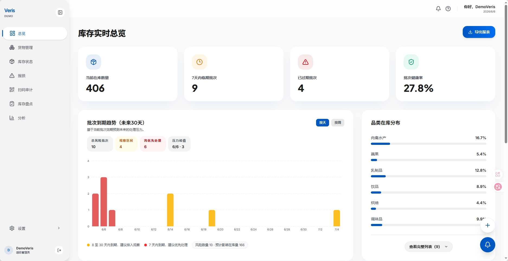
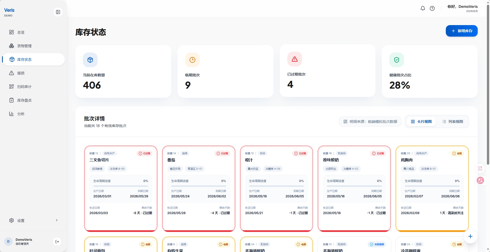
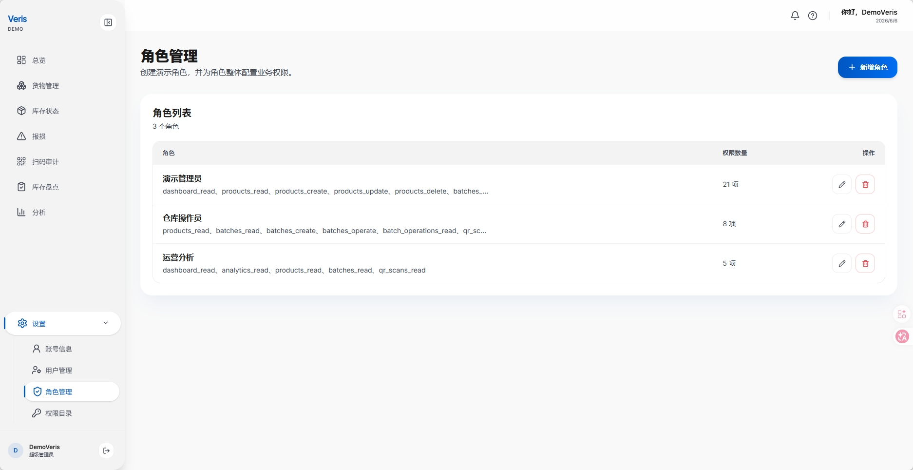
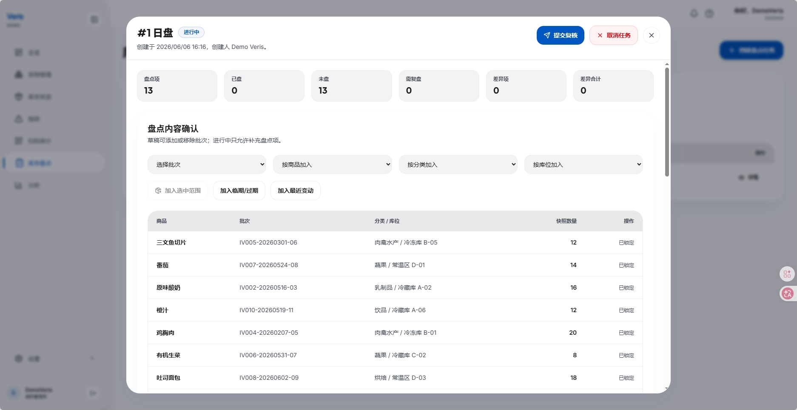
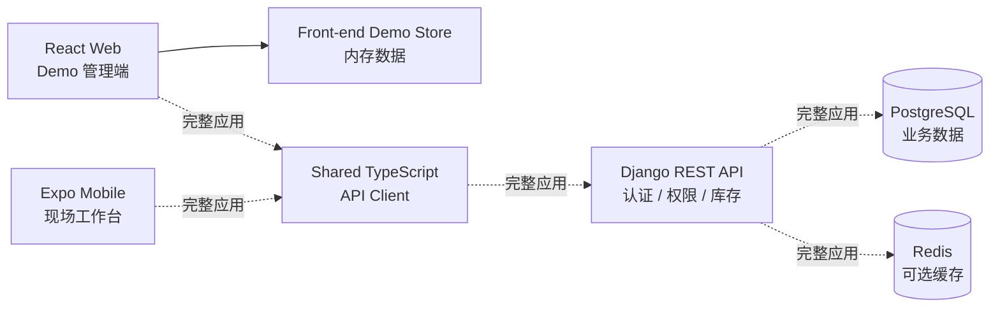
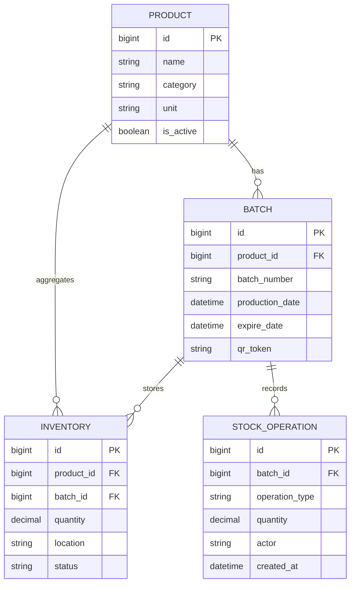

# Initium-Veris Demo

Food Inventory & Expiration Management System - Static Demo

<p align="center">
  
</p>

<p align="center">
  <strong>面向食品库存、批次追踪、效期管理和扫码审计的现代化库存管理系统演示版。</strong>
</p>

<p align="center">
  <a href="https://www.veris.haruta.top"></a>
  
  
  
  
  <a href="LICENSE"></a>
</p>

> **重要说明：当前 `demo` 分支只用于产品演示和界面预览。**
>
> Web 管理端默认使用前端内存 demo 数据，不连接真实后端、不需要数据库、不会持久化业务数据。这里保留 monorepo 中的后端与移动端代码，是为了展示完整项目结构；本 README 只说明 demo 分支的前端演示部署方式。

Initium-Veris Demo 展示食品库存管理系统的核心交互：库存看板、商品与批次、库存状态、盘点、报损、扫码审计、角色权限和系统设置。它适合用于项目展示、UI 评审、交互走查和静态站点部署。

## 为什么存在

食品库存管理的核心问题不是“有多少库存”，而是“哪一批库存、在哪个位置、还能安全使用多久、发生过哪些操作”。传统表格或普通进销存系统很容易漏掉批次、效期和扫码审计，最终导致临期品处理滞后、食品损耗升高、责任追溯困难。

Initium-Veris 通过批次级库存、效期预警、二维码追溯和扫码审计，把库存从静态数量变成可追踪、可预警、可复盘的业务链路，帮助团队降低食品损耗、提升周转效率，并为后续智能补货和销量预测保留数据基础。

## 核心特色

- **批次级库存管理**：每个商品批次独立记录数量、位置、效期和操作历史。
- **效期预警**：按批次到期时间识别正常、临期、过期和高风险库存。
- **二维码追溯**：为批次生成二维码凭证，支持标签打印和移动端扫码核验。
- **扫码审计**：记录扫码来源、处理结果和风险状态，形成可追溯审计记录。
- **静态演示体验**：demo 分支用前端内存数据复刻主要业务流程，不需要后端和数据库。
- **智能化演进空间**：Roadmap 规划智能补货、销量预测和损耗趋势分析。

## 截图展示

| 库存看板 | 库存状态 |
| --- | --- |
|  |  |

| 角色与权限 | 库存盘点 |
| --- | --- |
|  |  |

## 系统架构



## 数据库 ER 图

> Demo 分支不连接数据库；下图用于说明完整应用的数据模型。



## 在线 Demo

- 演示地址：[https://www.veris.haruta.top](https://www.veris.haruta.top)
- Demo 分支：`demo`
- Demo 说明：该分支用于无后端、无数据库的静态界面演示；完整应用部署流程保留在 `main` 分支。

## Demo 边界

- 不提供真实登录认证；账号状态由前端 demo store 模拟。
- 不连接 Django API；非测试模式下请求会被 `apps/web/src/api/demoStore.ts` 接管。
- 不需要 PostgreSQL、Redis、Docker、systemd 或后端环境变量。
- 刷新页面或重新部署后，演示数据会回到前端内置状态。
- 移动端和后端部署不属于本分支 README 的目标范围。

## 快速开始

环境要求：

- Node.js 22+
- pnpm 10+

安装依赖：

```bash
corepack enable
pnpm install
```

启动 Web demo：

```bash
pnpm --filter web dev
```

访问：

```text
http://localhost:3000
```

如需打开前端调试日志，可使用：

```bash
pnpm dev:debug
```

## 技术栈

| 模块 | 技术 |
| --- | --- |
| Web Demo | React 19、TypeScript、Vite、Tailwind CSS 4、React Router、React Query、Vitest |
| 共享包 | `@initium-veris/api-client`、DTO 类型、接口函数、查询键 |
| 工程化 | pnpm workspace、Turborepo、Cloudflare Workers Assets 配置 |

## Roadmap

**已完成**

- Web demo：看板、商品、库存、报损、扫码审计、分析、设置和角色权限页面
- 前端 demo store：模拟主要库存数据、登录状态和操作反馈
- 静态站点部署：Cloudflare Workers Assets 与通用静态托管说明
- README 截图、项目价值说明、架构图和 ER 图

**开发中**

- 演示数据覆盖更多异常场景和库存操作路径
- 盘点和扫码审计的演示流程补全
- 与 main 分支完整应用文档保持同步

**长期规划**

- 智能补货建议演示
- 销量预测与损耗趋势分析演示
- 临期处理策略推荐
- 多仓、多门店和供应商协同场景

## Demo 部署

### 方式一：Cloudflare Workers Assets

项目根目录已提供 [wrangler.jsonc](wrangler.jsonc)，静态资源目录指向 `apps/web/dist`。

构建：

```bash
pnpm install
pnpm --filter web build
```

部署：

```bash
npx wrangler deploy
```

`wrangler.jsonc` 已配置 SPA fallback：

```jsonc
{
  "assets": {
    "directory": "apps/web/dist",
    "not_found_handling": "single-page-application"
  }
}
```

### 方式二：任意静态站点托管

构建 Web demo：

```bash
pnpm --filter web build
```

将以下目录上传到静态托管平台：

```text
apps/web/dist
```

部署平台需要开启 SPA 回退，把未知路径回退到 `index.html`。适用平台包括 Cloudflare Pages、Vercel、Netlify、GitHub Pages 或 Nginx 静态站点。

## 常用命令

| 命令 | 说明 |
| --- | --- |
| `pnpm --filter web dev` | 启动 Web demo |
| `pnpm dev:debug` | 启动 Web debug 模式 |
| `pnpm --filter web build` | 构建静态演示站点 |
| `pnpm --filter web preview` | 本地预览构建产物 |
| `pnpm --filter web test` | 运行 Web 测试 |
| `pnpm --filter web check-types` | 检查 Web TypeScript 类型 |

## 文档

- [项目结构](docs/structure.md)
- [Web 结构](docs/frontend/structure.md)
- [Web 设计系统](docs/frontend/design.md)
- [Web 日志与 debug](docs/frontend/logging.md)
- [共享 API client](docs/shared/api-client.md)

## 开源协议

本项目基于 [Apache License 2.0](LICENSE) 开源。
