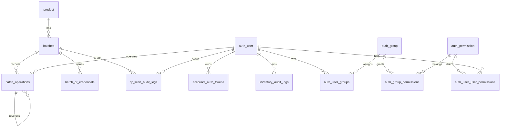

# Database Structure

本文档按当前 Django model、migration 和服务实现整理。后端运行时通过 `DATABASE_URL` 直连 PostgreSQL；测试时使用 SQLite 文件 `test.sqlite3`。

## Runtime Configuration

- 配置入口：`apps/api/config/settings.py`
- 环境读取：`apps/api/common/env.py`
- 数据库 URL：`DATABASE_URL`，必须使用 `postgres` 或 `postgresql` scheme
- 时区：`Asia/Shanghai`
- 认证 cookie：`origin_auth_token`
- CSRF cookie：`csrftoken`
- token pepper：`AUTH_TOKEN_PEPPER`，未配置时回退到 `SECRET_KEY`
- QR pepper：`QR_TOKEN_PEPPER`，未配置时回退到 `SECRET_KEY`

## Ownership

| 表 | Django 管理 | 说明 |
| --- | --- | --- |
| `auth_*` | 是 | Django 内置认证、角色和权限表 |
| `django_session` | 是 | Django session 表 |
| `accounts_auth_tokens` | 是 | API opaque token 表 |
| `inventory_audit_logs` | 是 | 商品和批次主数据审计 |
| `product` | 否，`managed = False` | 商品主数据 |
| `batches` | 否，`managed = False` | 批次主数据 |
| `batch_operations` | 否，`managed = False` | 库存操作历史 |
| `batch_qr_credentials` | 否，`managed = False` | 二维码凭证 |
| `qr_scan_audit_logs` | 否，`managed = False` | 扫码审计 |

`inventory` migrations 会安全地为既有业务表补充 actor 字段和性能索引，但不负责完整创建 `managed = False` 的业务表。

## Relationship



## Auth And Permission Tables

### accounts_auth_tokens

| 字段 | 类型 | 空值 | 约束/索引 | 说明 |
| --- | --- | --- | --- | --- |
| `id` | bigint | 否 | PK | token 记录 ID |
| `user_id` | integer | 否 | FK, `acct_auth_user_exp_idx` | Django 用户 |
| `token_hash` | varchar(64) | 否 | unique | `sha256(token + AUTH_TOKEN_PEPPER)` |
| `issued_at` | timestamptz | 否 | - | 签发时间 |
| `expires_at` | timestamptz | 否 | `acct_auth_user_exp_idx` | 过期时间 |
| `revoked_at` | timestamptz | 是 | `acct_auth_revoked_idx` | 吊销时间 |

### Django auth

- 用户表使用 Django 默认 `auth_user`。
- 角色使用 `auth_group`。
- 业务权限复用 `auth_permission`，业务 codename 存储在 `codename`。
- 业务权限 ContentType：`app_label = accounts`，`model = componentpermission`。
- `accounts.signals` 在 `post_migrate` 后同步业务权限。
- 超级管理员自动拥有全部业务权限。

## Inventory Tables

### product

| 字段 | 类型 | 空值 | 约束/索引 | 说明 |
| --- | --- | --- | --- | --- |
| `id` | bigint | 否 | PK | 商品 ID |
| `barcode` | varchar(255) | 否 | unique | 商品条码 |
| `product_name` | varchar(255) | 否 | - | 商品名称 |
| `shelf_life_days` | integer | 否 | - | 保质期天数，接口要求不小于 `0` |
| `location` | varchar(255) | 是 | - | 位置 |
| `category` | varchar(255) | 是 | `product_category_idx` | 分类 |
| `unit` | varchar(255) | 是 | - | 单位 |
| `created_at` | timestamptz | 否 | - | 创建时间 |
| `updated_at` | timestamptz | 否 | - | 更新时间 |
| `manufacturer` | text | 否 | - | 厂商 |

### batches

| 字段 | 类型 | 空值 | 约束/索引 | 说明 |
| --- | --- | --- | --- | --- |
| `id` | integer | 否 | PK | 批次 ID |
| `product_id` | bigint | 否 | FK, `batches_product_id_idx` | 商品 ID |
| `batch_code` | varchar(255) | 否 | - | 批次号 |
| `quantity` | numeric(12,2) | 是 | - | 当前库存数量 |
| `received_at` | timestamptz | 否 | `batches_received_at_id_idx` | 入库时间 |
| `manufacture_date` | date | 是 | - | 生产日期 |
| `expire_date` | date | 是 | `batches_expire_date_idx` | 到期日期 |
| `status` | varchar(255) | 是 | `batches_status_idx` | `unopened`、`opened`、`used_up` 或空 |
| `remarks` | varchar(255) | 是 | - | 备注 |

业务约定：

- 创建批次时初始数量固定为 `0.00`。
- 数量只能由 `batch_operations` 改变。
- `status = used_up` 由库存操作在数量归零时自动维护，状态接口不允许直接设置为 `used_up`。
- `expire_date` 可由 `manufacture_date + product.shelf_life_days` 自动推导。

### batch_operations

| 字段 | 类型 | 空值 | 约束/索引 | 说明 |
| --- | --- | --- | --- | --- |
| `id` | bigint | 否 | PK | 操作 ID |
| `batch_id` | integer | 否 | FK, `batch_ops_batch_created_idx` | 批次 ID |
| `reversed_operation_id` | bigint | 是 | unique FK | 被撤销的原操作 |
| `operation_type` | varchar(20) | 否 | `batch_operations_type_idx` | `add`、`loss`、`deduct` |
| `quantity` | numeric(12,2) | 否 | 建议检查 `> 0` | 操作数量，始终为正 |
| `quantity_after` | numeric(12,2) | 否 | 建议检查 `>= 0` | 操作后数量 |
| `remarks` | varchar(255) | 是 | - | 备注 |
| `created_at` | timestamptz | 否 | `batch_ops_batch_created_idx` | 操作时间 |
| `operator_id` | integer | 是 | FK, `batch_ops_operator_idx` | 操作用户 |

### batch_qr_credentials

| 字段 | 类型 | 空值 | 约束/索引 | 说明 |
| --- | --- | --- | --- | --- |
| `id` | bigint | 否 | PK | 凭证 ID |
| `batch_id` | integer | 否 | FK, `batch_qr_batch_rev_idx` | 批次 ID |
| `batch_code` | varchar(255) | 否 | `batch_qr_credentials_code_idx` | 签发时批次号快照 |
| `token_hash` | varchar(64) | 否 | unique | `sha256(token + QR_TOKEN_PEPPER)` |
| `issued_at` | timestamptz | 否 | - | 签发时间 |
| `revoked_at` | timestamptz | 是 | `batch_qr_batch_rev_idx` | 吊销时间 |
| `created_by` | varchar(255) | 是 | - | 签发来源或用户 |

二维码内容格式为 `OB1|{batch_code}|{token}`。明文 token 只在标签载荷接口响应中返回。

### qr_scan_audit_logs

| 字段 | 类型 | 空值 | 约束/索引 | 说明 |
| --- | --- | --- | --- | --- |
| `id` | varchar(40) | 否 | PK | `scan_<uuid>` |
| `raw_qr` | text | 否 | - | 原始二维码 |
| `batch_id` | integer | 是 | FK, `qr_audit_batch_scan_idx` | 匹配批次 |
| `batch_code` | varchar(255) | 是 | - | 解析或匹配到的批次号 |
| `source` | varchar(50) | 否 | `qr_audit_client_scan_idx` | `web_camera`、`mobile_camera`、`handheld` |
| `device_id` | varchar(255) | 是 | `qr_audit_client_scan_idx` | 设备 ID |
| `client_scan_id` | varchar(255) | 是 | `qr_audit_client_scan_idx` | 客户端扫码 ID |
| `scanner_user` | varchar(255) | 是 | - | 文本兼容字段 |
| `scanner_user_id` | integer | 是 | FK, `qr_audit_scanner_idx` | 扫码用户 |
| `scanned_at_client` | timestamptz | 是 | - | 客户端扫码时间 |
| `scanned_at_server` | timestamptz | 否 | `qr_audit_batch_scan_idx` | 服务端接收时间 |
| `ip_address` | inet | 是 | - | 请求 IP |
| `user_agent` | text | 是 | - | User-Agent |
| `result_status` | varchar(20) | 否 | `qr_scan_audit_logs_status_idx` | 扫码结果 |
| `result_message` | text | 否 | - | 前端展示消息 |
| `failure_reason` | varchar(255) | 是 | - | 失败原因 |

`client_scan_id` 非空时，服务层按 `source + device_id + client_scan_id` 去重。

### inventory_audit_logs

| 字段 | 类型 | 空值 | 约束/索引 | 说明 |
| --- | --- | --- | --- | --- |
| `id` | bigint | 否 | PK | 审计 ID |
| `resource_type` | varchar(50) | 否 | `inv_audit_resource_idx` | `product` 或 `batch` |
| `resource_id` | varchar(64) | 否 | `inv_audit_resource_idx` | 资源 ID |
| `action` | varchar(50) | 否 | `inv_audit_action_idx` | `create`、`update`、`delete`、`status_update` |
| `actor_id` | integer | 否 | FK, `inv_audit_actor_idx` | 操作用户 |
| `snapshot` | jsonb | 否 | - | 操作时快照 |
| `created_at` | timestamptz | 否 | 多列索引 | 审计时间 |

## Recommended DDL Checks

生产库至少应具备以下约束或索引。部分索引已由 migrations 以 `CREATE INDEX IF NOT EXISTS` 方式补充。

```sql
CREATE INDEX IF NOT EXISTS product_category_idx ON product(category);
CREATE INDEX IF NOT EXISTS batches_product_id_idx ON batches(product_id);
CREATE INDEX IF NOT EXISTS batches_status_idx ON batches(status);
CREATE INDEX IF NOT EXISTS batches_expire_date_idx ON batches(expire_date);
CREATE INDEX IF NOT EXISTS batches_received_at_id_idx ON batches(received_at DESC, id DESC);
CREATE INDEX IF NOT EXISTS batch_ops_batch_created_idx ON batch_operations(batch_id, created_at DESC, id DESC);
CREATE INDEX IF NOT EXISTS batch_operations_type_idx ON batch_operations(operation_type);
CREATE INDEX IF NOT EXISTS batch_ops_operator_idx ON batch_operations(operator_id);
CREATE INDEX IF NOT EXISTS batch_qr_batch_rev_idx ON batch_qr_credentials(batch_id, revoked_at);
CREATE INDEX IF NOT EXISTS batch_qr_credentials_code_idx ON batch_qr_credentials(batch_code);
CREATE INDEX IF NOT EXISTS qr_audit_batch_scan_idx ON qr_scan_audit_logs(batch_id, scanned_at_server DESC);
CREATE INDEX IF NOT EXISTS qr_audit_client_scan_idx ON qr_scan_audit_logs(source, device_id, client_scan_id);
CREATE INDEX IF NOT EXISTS qr_scan_audit_logs_status_idx ON qr_scan_audit_logs(result_status);
CREATE INDEX IF NOT EXISTS qr_audit_scanner_idx ON qr_scan_audit_logs(scanner_user_id);
```

## Notes
- 商品、批次、操作、二维码和扫码表的结构变更不能只改 Django model，必须同步生产数据库 DDL。
- 如果生产库已有历史数据，新增非空约束前需要先做回填。
- 模糊搜索如需进一步优化，可评估 PostgreSQL trigram 索引；这属于性能优化，不是当前结构硬要求。
